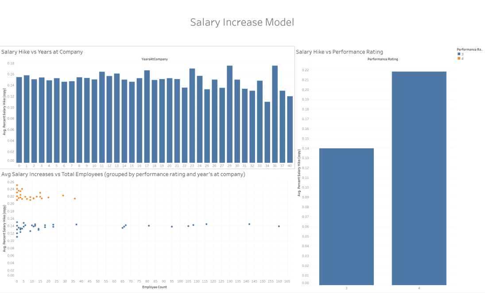
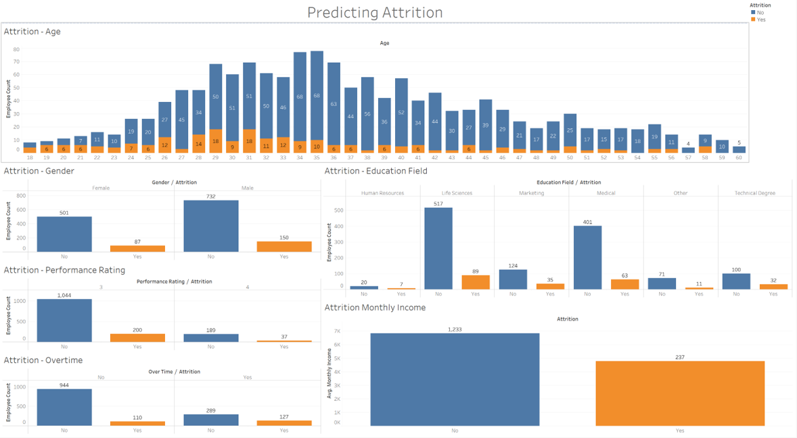

📚 HR Data Analysis & Visualization 

## Project Goal 🎯
The goal of this project is to demonstrate data analysis techniques such as data cleaning and performing EDA using Python along with producing dashboards to present business solutions.    

## Business Problem 🏢
Using a HR dataset provided by IBM, we will address the following questions: 
1. What metrics can be used to help predict an employee's upcoming salary increase? 

🎯 **Bonus: Classification Model - Predicting Attrition** 🎯

## Process and Results 📈

### Upload Dataset

### Quality Assurance Process
| Task | Description |
| ---- | ----------- |
| General Review | Formatting, understanding values, etc |
| Null Counts | Checking null counts on all columns |
| Age Validation | Applying reasonable limits on age columns |
| Data Types Review | Reviewing appropriate data types |
| Duplicates Check | Checking for duplicates in EmployeeID |
| Irrelevant Columns | Dropped columns like EmployeeCount and StandardHours |
| Transformations | Percent columns converted to decimal formats; label encoding for categorical data during models |

### Performing EDA
- General EDA to get statistics of the dataset using `.describe()`
- Analysis of variables related to Salary Increase and Attrition
- Utilization of boxplot, kdeplot, pairplot, and correlation heatmap for visual analysis

### Regression Model - Predicting Salary Increases
- Employed backward selection in OLS models to finalize significant variables
- Identified Years at Company and Performance Rating as significant predictors

### Classification Model - Predicting Attrition
- Relevant metrics identified: Gender, Age, PerformanceRating, EducationField, MonthlyIncome, OverTime
- Conducted using RandomForestClassifier
- Model summary: 85% accuracy, Precision for No's at 89% and Yes's at 38%

### Tableau Dashboards
- Compiled visuals from EDA into a comprehensive dashboard
- Interactive elements for analyzing Salary Increase and Attrition

## Challenges and Learnings 🤔
- Learning classification model selection and interpretation of recall
- Desire to explore more in-depth machine learning model interpretations

## Dashboards 📊

Here are the dashboards created as part of the project, showcasing the insights and analysis:

### First Dashboard

### Second Dashboard

---

**Note:** This project is part of an academic exercise in data analysis and visualization.

---

